# AWS Account Setup

[Articles](https://nirmalakumarsahu.in/aws.html) | [My Profile](https://nirmalakumarsahu.in)

 

---

## Index

- [What is AWS?](#what-is-aws)
  - [What AWS Offers](#%EF%B8%8F-what-aws-offers)
  - [Key Benefits of Using AWS](#-key-benefits-of-using-aws)
  - [Common Use Cases](#-common-use-cases)
  - [Who Uses AWS?](#-who-uses-aws)
  - [AWS Free Tier](#-aws-free-tier)
  - [Security and Compliance](#-security-and-compliance)
  - [Accessing AWS](#-accessing-aws)
- [Step-by-Step Guide to Create an AWS Account](#step-by-step-guide-to-create-an-aws-account)

---

## What is AWS?

- **Amazon Web Services (AWS)** is the world’s most comprehensive and broadly adopted **cloud platform**, offering over **200 fully featured services** from data centers globally. Businesses of all sizes—from startups to enterprises—use AWS to **deploy, manage, and scale applications and infrastructure** without the need to manage physical servers.
- Amazon Web Services (AWS) is a comprehensive and widely adopted cloud computing platform offered by Amazon. It provides on-demand cloud services such as computing power, storage, databases, machine learning, analytics, security, and more, on a pay-as-you-go basis.
- AWS allows users to access computing resources over the internet, enabling them to run applications, store data, and perform various tasks without the need for physical hardware.

### 🏗️ What AWS Offers

AWS provides a broad set of services that can be grouped into categories like:

| Category                    | Key Services                                    |
| --------------------------- | ----------------------------------------------- |
| **Compute**                 | EC2, Lambda, ECS, EKS                           |
| **Storage**                 | S3, EBS, Glacier                                |
| **Databases**               | RDS, DynamoDB, Aurora, Redshift                 |
| **Networking**              | VPC, Route 53, API Gateway, CloudFront          |
| **Security**                | IAM, KMS, WAF, Cognito                          |
| **Monitoring & Management** | CloudWatch, CloudTrail, Config                  |
| **Machine Learning**        | SageMaker, Comprehend, Rekognition              |
| **Developer Tools**         | CodeCommit, CodeBuild, CodeDeploy, CodePipeline |

### 💡 Key Benefits of Using AWS

1. **Scalability:** Instantly scale up or down depending on demand.
2. **Cost-Efficiency:** Pay only for what you use (pay-as-you-go model).
3. **High Availability:** Global network of data centers ensures uptime and performance.
4. **Security:** Built with top-tier security standards (ISO 27001, SOC 1/2/3).
5. **Flexibility:** Use your preferred OS, language, and tools.
6. **Global Reach:** Data centers in **over 30 geographic regions** worldwide.

### 📊 Common Use Cases

* Hosting websites and web apps
* Mobile app backends
* Big data analytics
* Machine learning & AI
* Gaming servers
* IoT applications
* Data backup and recovery

### 🎓 **Who Uses AWS?**

AWS is used by:

* **Startups** for rapid product development
* **Enterprises** like Netflix, Airbnb, BMW, NASA for scale and agility
* **Government organizations** for secure and compliant infrastructure
* **Developers and students** for learning cloud technologies

### 🆓 **AWS Free Tier**

New AWS accounts get **free access** to many popular services for 12 months, including:

* **750 hours/month of EC2 (t2.micro)**
* **5 GB of S3 storage**
* **750 hours/month of RDS**
* And many more...

Useful for learning, testing, and proof-of-concept projects.

### 🛡️ **Security and Compliance**

AWS provides **robust security**, with built-in features like:

* **Encryption at rest and in transit**
* **IAM** for role-based access control
* **Multi-factor authentication (MFA)**
* **Audit trails via CloudTrail**

They also comply with global standards like **HIPAA, GDPR, SOC**, and more.

### 🛠️ **Accessing AWS**

You can interact with AWS through:

* **AWS Management Console (Web UI)**
* **AWS CLI (Command Line Interface)**
* **AWS SDKs** (for programming in Java, Python, JavaScript, etc.)
* **Infrastructure as Code** tools (like CloudFormation, Terraform)

### [🔝 Back to Top](#index)

---

## Step-by-Step Guide to Create an AWS Account

### **Step 1: Go to the AWS Website**

* Visit [https://aws.amazon.com](https://aws.amazon.com).
* Click on **"Create an AWS Account"**.

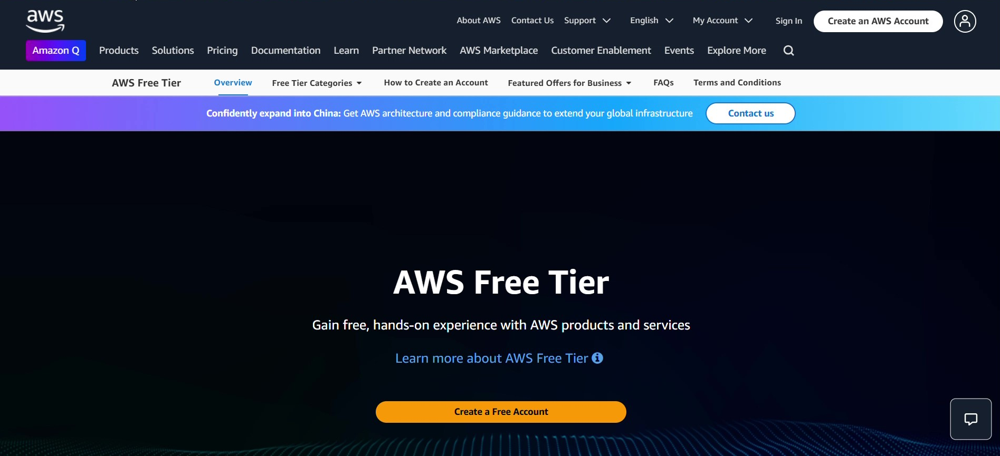

### **Step 2: Start the Sign-Up Process**

* Click on **"New to AWS? Sign up"**.

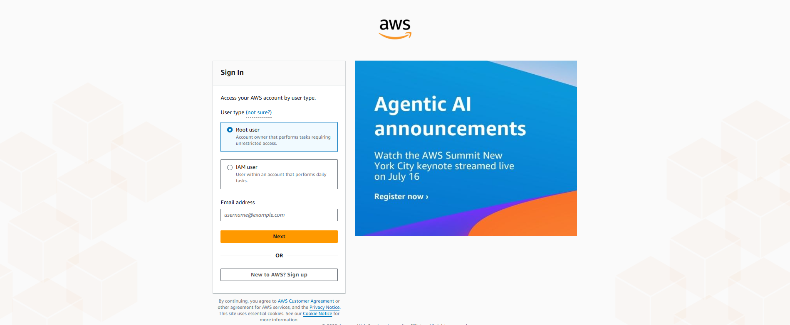

### **Step 3: Enter Root User Information**

* Provide your **Root user email address** and an **AWS account name**.
* Click on **"Verify email address"**.

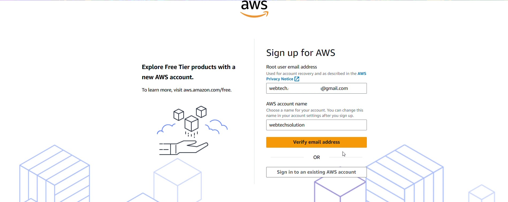

### **Step 4: Email Verification**

* Check your email for a **verification code** sent by AWS.
* Enter the **verification code** on the AWS page.
* Click **"Verify"**.

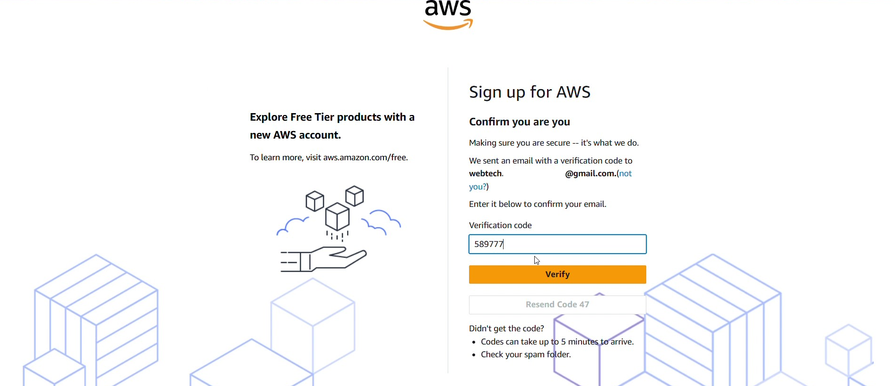

### **Step 5: Set Root User Password**

* Enter a **strong password** and confirm it.
* Click **"Continue"**.

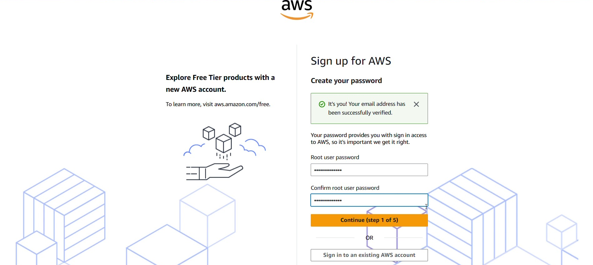

### **Step 6: Provide Contact Information**

* Choose **"Personal – For your own projects"** under "How do you plan to use AWS?"
* Fill in the following:

  * **Full Name**
  * **Country Code & Phone Number**
  * **Country/Region**
  * **Address details**
* Check **"I have read and agree to the terms"**.
* Click **"Agree and Continue"**.

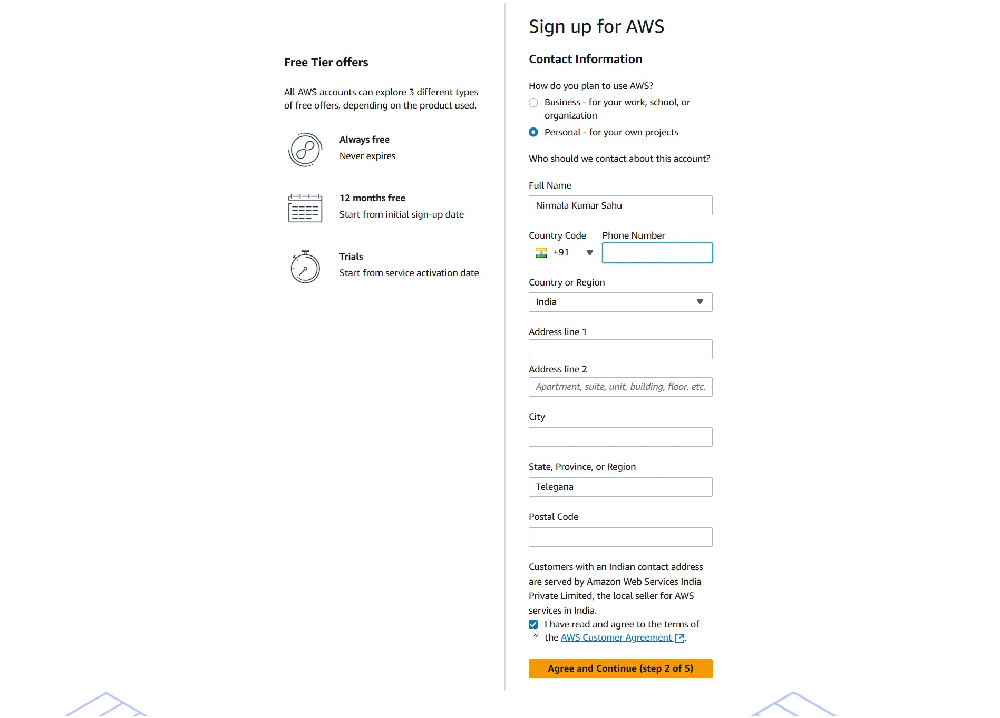

### **Step 7: Add Billing Information**

* Select your **Billing Country**.
* Enter your **card details** and **billing address**.
* Click **"Verify and Continue"**.
* You may receive a small test charge for verification — enter the **OTP** from your bank to complete.

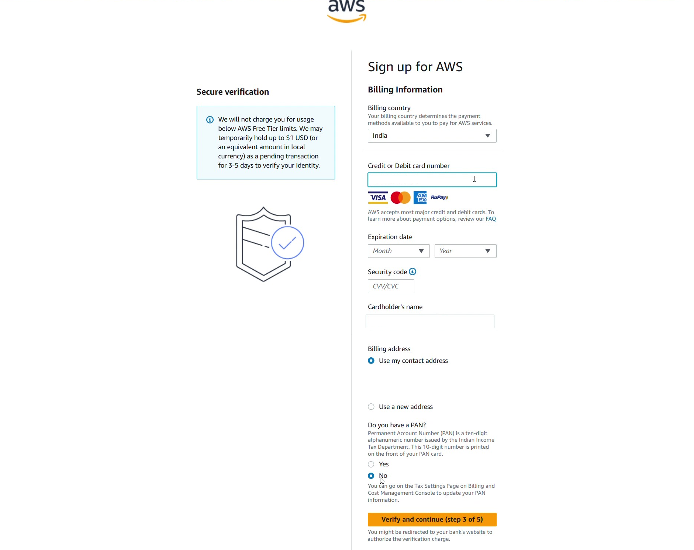

### **Step 8: Identity Confirmation**

* Fill in your identity details (name, address, etc.).
* Click **"Continue"**.

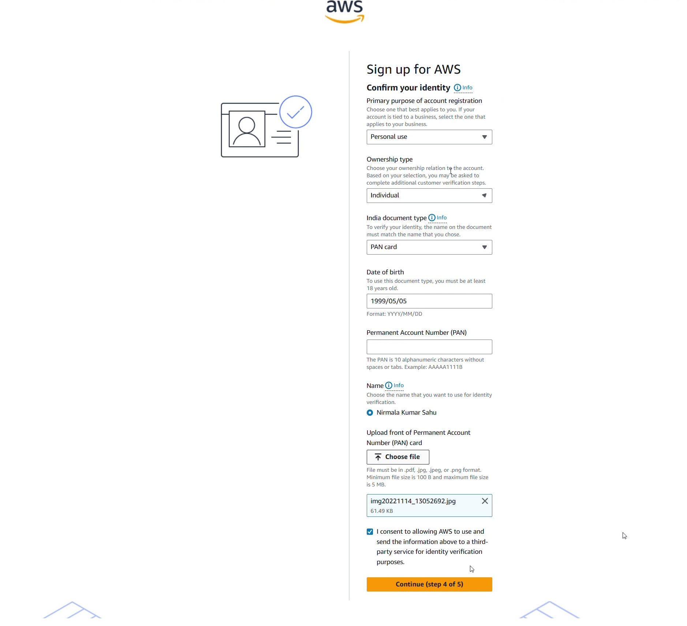

### **Step 9: Mobile Number Verification**

* Enter your **mobile number**.
* Complete the CAPTCHA.
* Click **"Send SMS"**.

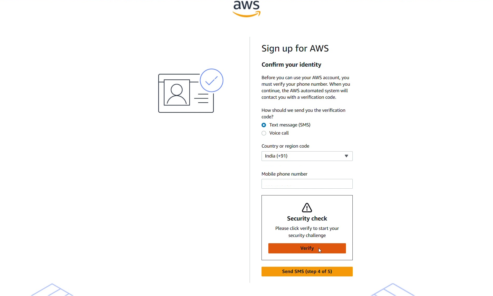

### **Step 10: Enter SMS Verification Code**

* Enter the **verification code** sent to your phone.
* Click **"Continue"**.

### **Step 11: Select a Support Plan**

* Choose **Basic Support – Free**.
* Click **"Complete sign-up"**.

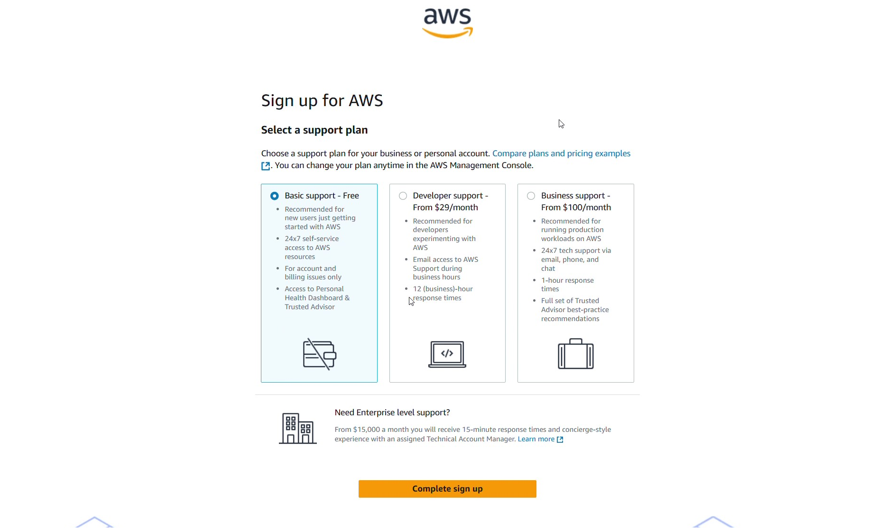

### **Step 12: Final Confirmation**

* You will see a **"Congratulations"** screen.
* Click **"Go to the AWS Management Console"** to log in.
* You’re now ready to start using AWS!

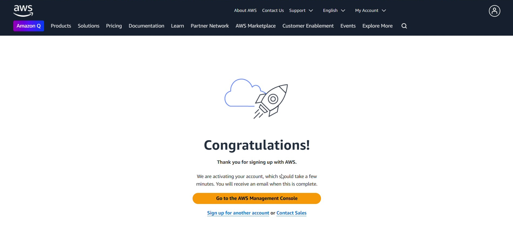

### [🔝 Back to Top](#index)

### [Read More ➡️](https://nirmalakumarsahu.in/aws.html)

---