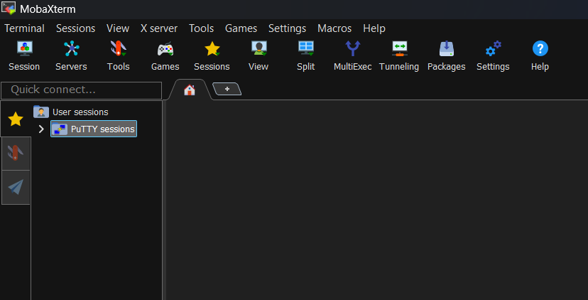
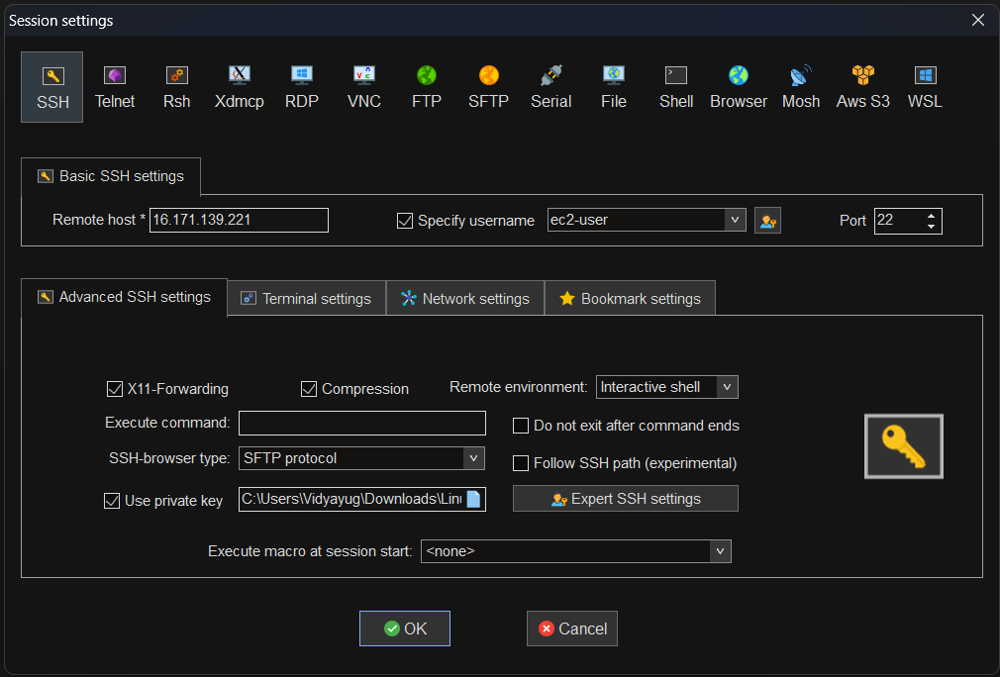

# Connecting to EC2 Instance using MobaXterm

[Articles](https://nirmalakumarsahu.in/aws.html) | [My Profile](https://nirmalakumarsahu.in)

   

---

## Index

- [🧰 What is MobaXterm?](#-what-is-mobaxterm)
  - [🧾 Key Features of MobaXterm](#-key-features-of-mobaxterm)
  - [🛠️ Common Use Cases](#-common-use-cases)
  - [🆚 MobaXterm vs Other Tools](#-mobaxterm-vs-other-tools)
  - [✅ Summary](#-summary)
- [🔐 How to Connect to an EC2 Instance Using MobaXterm](#-how-to-connect-to-an-ec2-instance-using-mobaxterm)
  
---
## 🧰 What is **MobaXterm**?

**MobaXterm** is an **all-in-one remote computing tool for Windows**. It provides a **powerful terminal interface** for developers, sysadmins, and IT professionals to connect remotely to servers using protocols like **SSH, SFTP, RDP, VNC, and more**.

It's especially popular among Windows users who need **Linux-like features and SSH capabilities**.

### 🧾 Key Features of MobaXterm

| Feature                          | Description                                                                               |
| -------------------------------- | ----------------------------------------------------------------------------------------- |
| 🖥️ **SSH Client**               | Easily connect to remote Linux servers over SSH (e.g., AWS EC2 instances).                |
| 📁 **SFTP Browser**              | Automatically shows a file manager when connected via SSH — upload/download files easily. |
| 🧮 **X11 Server**                | Allows you to run graphical Linux apps remotely (GUI over SSH).                           |
| 💻 **Tabbed Terminal**           | Run multiple terminal sessions (Bash, PowerShell, CMD) in one window.                     |
| 🛠️ **Unix Commands on Windows** | Built-in Linux commands like `ls`, `grep`, `scp`, `curl`, `wget`, etc.                    |
| 🧩 **RDP/VNC/FTP/SCP Support**   | Built-in support for multiple remote access protocols.                                    |
| 📦 **Portable or Installer**     | Use it without installation (portable) or install it permanently.                         |
| 🧠 **Macros & Snippets**         | Save frequent commands and automate actions.                                              |

### 🛠️ Common Use Cases

✅ **Connecting to AWS EC2** (Linux):

* Use SSH with `.pem` or `.ppk` files
* Built-in file manager for easy transfers

✅ **Managing Remote Linux Servers** from Windows

✅ **Running Bash/Linux commands** on Windows

✅ **Graphical applications over SSH** using X11 forwarding

### 🆚 MobaXterm vs Other Tools

| Tool                       | OS             | Key Advantage                                          |
| -------------------------- | -------------- | ------------------------------------------------------ |
| **MobaXterm**              | Windows        | All-in-one GUI + SSH + SFTP + Unix tools               |
| **PuTTY**                  | Windows        | Lightweight SSH client (no file transfer by default)   |
| **Termius**                | Cross-platform | Beautiful UI, cloud sync, but limited free features    |
| **Windows Terminal + WSL** | Windows 10+    | Native Linux on Windows with advanced terminal support |

### ✅ Summary

**MobaXterm** is the **best all-in-one SSH tool for Windows users** who work with Linux servers, especially for:

* **Remote access**
* **File transfer**
* **Running commands**
* **X11 GUI forwarding**

### [🔝 Back to Top](#index)

---

## 🔐 How to Connect to an EC2 Instance Using MobaXterm

**Step 1: Install MobaXterm**

Download the free edition of MobaXterm from the official website:

🔗 [Download MobaXterm](https://mobaxterm.mobatek.net/download.html)

**Step 2: Gather EC2 Connection Details**

Before you start, ensure you have the following:

| Detail                         | Description                                                            |
| ------------------------------ | ---------------------------------------------------------------------- |
| 🌐 **Public IP Address**       | Available on your EC2 instance dashboard.                              |
| 🔐 **Private Key (.pem file)** | Downloaded during instance creation. Required for SSH authentication.  |
| 👤 **Username**                | Depends on the AMI: `ec2-user` (Amazon Linux), `ubuntu` (Ubuntu), etc. |
| 🚪 **SSH Port**                | Default is `22`.                                                       |

🔗 [Full EC2 Setup Guide](https://nirmalakumarsahu.in/articles/aws/ec2-instance-setup)

**Step 3: Launch MobaXterm and Create an SSH Session**

1. Open **MobaXterm**.
2. Click the **"Session"** button in the top-left corner.

**Step 4: Configure the SSH Session**

1. Choose **SSH** as the session type.
2. Fill in the following:

    * **Remote host**: Enter your EC2 public IP (e.g., `ec2-13-234-XXX-XXX.compute.amazonaws.com`).
    * **Specify username**: e.g., `ec2-user`, `ubuntu`.
    * **Port**: Use default `22`.
    * Check **“Use private key”**, then **browse and select your `.pem` file**.

> ✅ **Tip**: Make sure the `.pem` file has proper permissions (`chmod 400 key.pem` if you test on Linux later).

**Step 5: Connect to EC2**

Click **OK** to start the session.

* The first time you connect, you'll be prompted to **trust the remote host**.
* Once connected, a terminal will open, and you'll have **shell access** to your EC2 instance.
* The **left panel** will show an **SFTP file browser** — you can drag and drop files directly to/from the EC2 instance.

### [🔝 Back to Top](#index)

### [Read More ➡️](https://nirmalakumarsahu.in/aws.html)

---