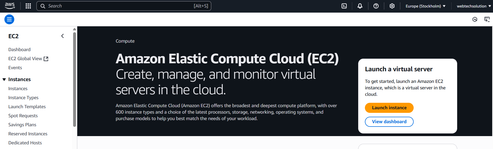
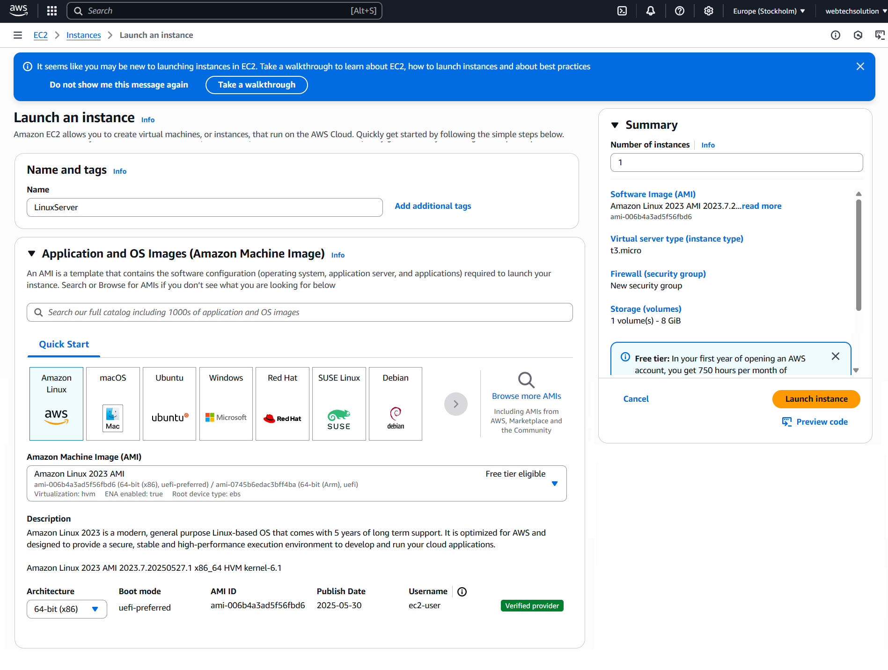
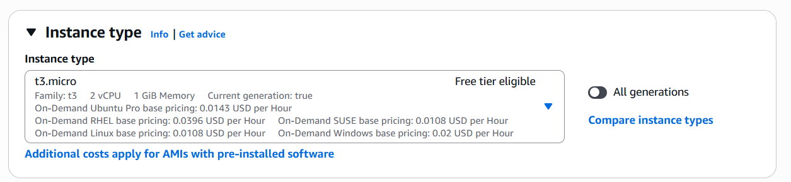
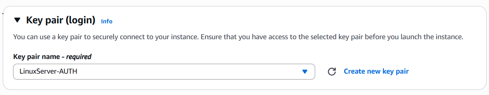
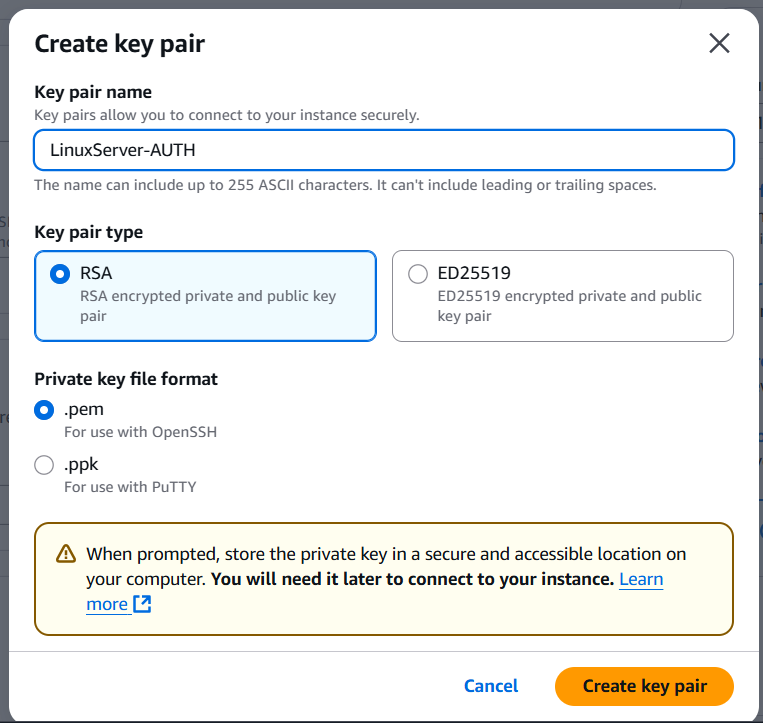
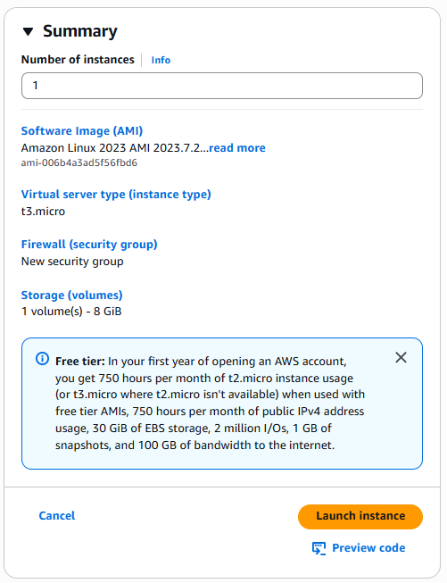
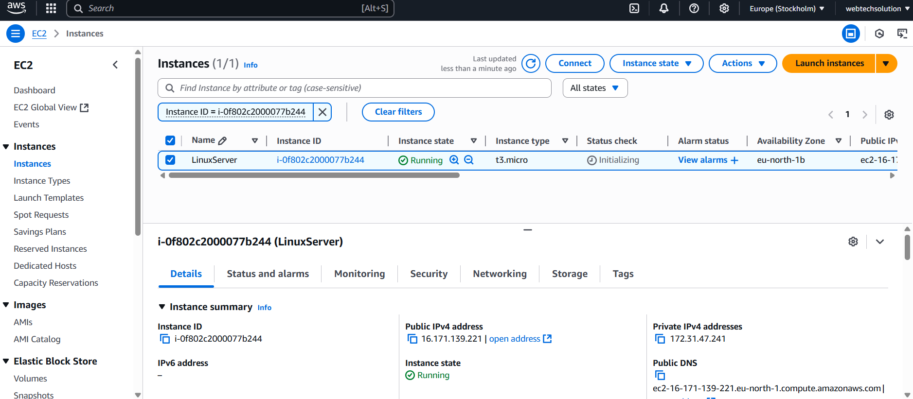

# AWS Account Setup

[Articles](https://nirmalakumarsahu.in/aws.html) | [My Profile](https://nirmalakumarsahu.in)

 

---

## Index

- [🚀 What is Amazon EC2?](#-what-is-amazon-ec2)
  - [🧱 Key Features of EC2](#-key-features-of-ec2)
  - [🛠️ When Should You Use EC2?](#-when-should-you-use-ec2)
  - [🗂️ EC2 Pricing Models](#-ec2-pricing-models)
  - [📦 EC2 Lifecycle (How It Works)](#-ec2-lifecycle-how-it-works)
  - [✅ Benefits of Using EC2](#-benefits-of-using-ec2)
  - [💬 Summary](#-summary)
- [✅ Step-by-Step Guide to Launch an EC2 Instance on AWS](#-step-by-step-guide-to-launch-an-ec2-instance-on-aws)

---

Absolutely! Here's a **more polished and complete explanation of EC2**, tailored for both technical and non-technical readers:

---

## 🚀 What is Amazon EC2?

**Amazon EC2 (Elastic Compute Cloud)** is a **virtual server in the cloud** provided by **Amazon Web Services (AWS)**. It allows you to **run applications just like you would on a physical server**, but without the cost and complexity of maintaining hardware.

Think of EC2 as **your own server on-demand** that you can start, stop, resize, or terminate at any time — all within a few clicks or lines of code.

### 🧱 Key Features of EC2

| Feature                           | Description                                                                        |
| --------------------------------- | ---------------------------------------------------------------------------------- |
| 🖥️ **Virtual Server (Instance)** | Launch scalable compute power in minutes. Choose OS, hardware, and network config. |
| 🧩 **Pre-built OS Images (AMIs)** | Use ready-to-go templates like Ubuntu, Red Hat, or custom ones.                    |
| 🧠 **Instance Types**             | Choose from general purpose, compute-optimized, memory-optimized, and more.        |
| 🔐 **Security Groups**            | Acts like a virtual firewall — control who can access your instance.               |
| 🔑 **SSH Key Pair**               | Secure access to Linux instances; private key stays with you.                      |
| 💾 **EBS Storage**                | Attach persistent storage (like a hard disk) to your EC2 instance.                 |
| 🌐 **Elastic IP**                 | Assign a static public IP to your instance so it’s always reachable.               |
| 📈 **Auto Scaling**               | Automatically add/remove instances based on traffic or load.                       |
| ⚖️ **Load Balancer (ELB)**        | Distribute traffic evenly across multiple EC2s.                                    |

### 🛠️ When Should You Use EC2?

✅ EC2 is perfect for:

* Hosting websites or backend APIs
* Running containerized apps (with Docker, ECS, or Kubernetes)
* Big data processing (e.g., Hadoop, Spark)
* Development and testing environments
* Machine learning model training
* Game server hosting

### 🗂️ EC2 Pricing Models

| Type                      | When to Use                       | Cost                                |
| ------------------------- | --------------------------------- | ----------------------------------- |
| 💵 **On-Demand**          | Short-term, no commitment         | Pay-per-use (hour or second)        |
| 🛒 **Reserved Instances** | Long-term workloads (1–3 years)   | Up to 75% cheaper                   |
| 📉 **Spot Instances**     | Flexible, fault-tolerant apps     | 90% discount but can be interrupted |
| 💼 **Savings Plans**      | General compute savings over time | Flexible across services            |

### 📦 EC2 Lifecycle (How It Works)

Here’s a typical EC2 setup process:

**1. Choose AMI :** Select the OS image (e.g., Amazon Linux, Ubuntu, Windows Server).

**2. Choose Instance Type :** Select hardware config (e.g., `t2.micro`, `m5.large`) based on CPU, memory needs.

**3. Configure Instance :** Set instance count, IAM roles, networking (VPC, subnet).

**4. Add Storage :** Attach EBS volumes as your root (boot) and additional disks.

**5. Add Tags :** Label instances (e.g., Name = “Spring Boot Server”).

**6. Set Up Security Group :** Open required ports (e.g., 22 for SSH, 80/443 for web, 8080 for app).

**7. Launch & Connect :** Use your SSH key to log in (for Linux) or RDP (for Windows).

### ✅ Benefits of Using EC2

| Advantage                  | Why It Matters                                                         |
| -------------------------- | ---------------------------------------------------------------------- |
| 🌍 **Global Availability** | Launch instances in any AWS region/zone worldwide.                     |
| 📏 **Scalable**            | Start with one instance, scale to thousands automatically.             |
| 🔒 **Secure**              | Built-in firewalls, encrypted storage, IAM roles, and VPC integration. |
| 🛠️ **Customizable**       | Choose CPU, memory, OS, storage, network — everything is configurable. |
| 🧩 **Integrated with AWS** | Seamless with S3, RDS, CloudWatch, Lambda, etc.                        |

### 💬 Summary

Amazon EC2 is like **having your own high-powered, flexible data center**, but with:

* No upfront investment
* Pay-as-you-go pricing
* Full control over software and hardware specs
* Easy scalability for traffic surges

### [🔝 Back to Top](#index)

---

## ✅ Step-by-Step Guide to Launch an EC2 Instance on AWS

**Step 1: Sign in to AWS Management Console**

Go to the [AWS Console](https://aws.amazon.com/console/) and log in with your credentials.
If you don't have an AWS account yet, [follow this guide to create one](https://nirmalakumarsahu.in/articles/aws/aws-account-setup).

**Step 2: Navigate to EC2 Dashboard**

From the AWS Console:

* In the **search bar**, type "`EC2`".
* Click on **EC2** under “Services”.

**Step 3: Launch an Instance**

Click the **“Launch Instance”** button to begin setting up your virtual server.

**Step 4: Name Your Instance & Choose an AMI**

* Enter a name like `MyAppServer`.
* Select an **Amazon Machine Image (AMI)**, such as:

    * ✅ **Amazon Linux 2023** *(lightweight, stable, AWS-optimized)*
    * 🐧 **Ubuntu Server 22.04 LTS** *(common for Java/Spring Boot apps)*
    * 🪟 **Windows Server** *(if required)*

**Step 5: Choose an Instance Type**

* Select an instance type based on compute and memory needs.
* For **free-tier eligible users**, select `t2.micro` or `t3.micro`.

**Step 6: Configure Key Pair for SSH**

To connect securely to your EC2 instance:

* If you **already have a key pair**, choose it from the dropdown.

* To **create a new key pair**:

    1. Click **Create new key pair**.
    2. Name it (e.g., `ec2-key-nirmal`).
    3. Choose `.PEM` (Linux/macOS) or `.PPK` (Windows).
    4. Click **Create** and download it — **you can’t download it again!**

**Step 7: Configure Security Group**

A **Security Group** acts like a firewall.

* Allow **SSH (port 22)** from your current IP.
* For web apps (like Spring Boot), allow:

    * **HTTP (port 80)** for public websites
    * **Custom TCP (port 8080)** if your app runs on 8080

💡 You can add rules later from the EC2 dashboard too.

**Step 8: Review and Launch**

* Double-check your instance details (AMI, type, key pair, security group).
* Click **Launch Instance**.

**Step 9: Connect to Your Instance**

Once launched:

1. Select your instance from the list.
2. Click **Connect**.
3. Use **SSH** in Terminal (Linux/macOS) or **PuTTY** (Windows):

### [🔝 Back to Top](#index)

### [Read More ➡️](https://nirmalakumarsahu.in/aws.html)

---