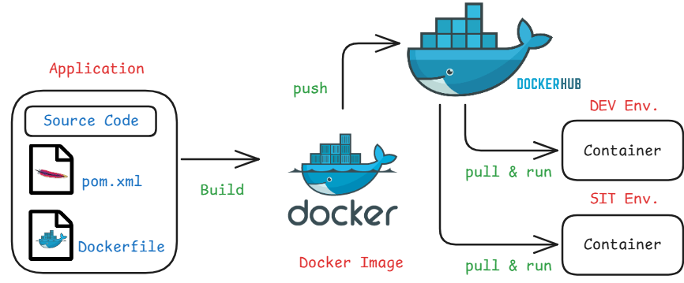
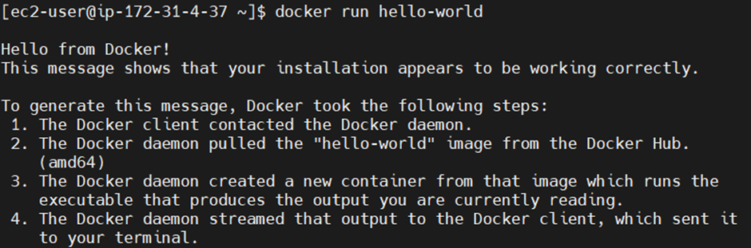
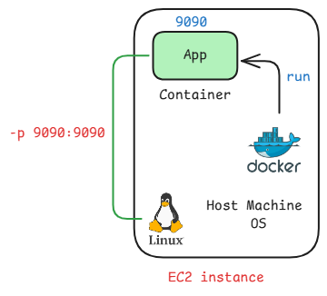

# Docker

[Articles](https://nirmalakumarsahu.in/articles.html) | [My Profile](https://nirmalakumarsahu.in)

[](https://www.docker.com/) [](https://www.docker.com/)

[](https://en.wikipedia.org/wiki/DevOps)

---

## Index
- [What is Docker?](#what-is-docker)
  - [Issues Without Docker](#issues-without-docker)
  - [Containerization](#containerization)
- [Docker Registry](#docker-registry)
- [Docker Setup on AWS EC2](#docker-setup-on-aws-ec2)
- [Docker Architecture](#docker-architecture)
  - [Docker Commands](#docker-commands)

---

## What is Docker?

- **Docker** is an open-source containerization software that enables developers to build, ship, and run applications using containers.

- **Containers** are lightweight, isolated environments that bundle an application with all its dependencies, ensuring it runs consistently across different environments.

- **Benefits of Docker**
  - **Portability**: Run applications anywhere, from local machines to cloud servers.
  - **Scalability**: Easily scale applications up or down with container orchestration.
  - **Consistency**: Eliminate issues caused by differences between development and production.
  - **Resource Efficiency**: Use system resources more efficiently compared to traditional virtual machines.

### Issues Without Docker

- **"It works on my machine" syndrome**: Applications behave differently in development, testing, and production due to inconsistent environments.

- **Complex setup and configuration**: Installing and configuring dependencies on every system can be time-consuming and error-prone.

- **Lack of environment isolation**: Multiple applications on the same machine can conflict over dependencies or versions.

- **Difficult scaling and deployment**: Manual deployment processes are slow, error-prone, and hard to scale reliably.

- **Harder collaboration**: Sharing and replicating environments across teams is difficult without a consistent runtime setup.

- **Increased system resource usage**: Traditional virtual machines are heavier and less efficient compared to containers.

> **Note**: To run our application, three key things are needed:
> - The code written by the developer.
> - Required libraries to execute the code (managed and downloaded using tools like Maven).
> - External software or system dependencies (e.g., databases, runtime environments) that are necessary for the application to run.

Installing and configuring all of these manually on different machines can be time-consuming and error-prone. **Docker helps by packaging the application, its libraries, and all required dependencies into a single container**, ensuring it runs consistently across any environment.


### Containerization 

- **Containerization** is the process of packaging software code and all its dependencies into containers.

- A **container** is a lightweight, portable virtual environment (not a full virtual machine).

- It ensures that the application runs reliably regardless of where it's deployed.

- **Popular containerization tools** include Docker, Podman, and LXC. 

- **Benefits of Containerization**
  - **Portability**: Run anywhere — local, staging, or production.
  - **Isolation**: Each container runs independently, reducing conflicts.
  - **Scalability**: Easily scale up or down using orchestrators like Kubernetes.
  - **Speed**: Faster boot times compared to VMs.
  - **Efficiency**: Lower resource usage by sharing the host OS kernel.

### [🔝 Back to Top](#index)

---

## Docker Registry

- A **Docker Registry** is a storage and distribution system for Docker images.

- It allows you to push, pull, and manage container images. 

- There are two types of registries
  - **Public** (accessible to anyone)
    - Ex: Docker Hub, GitHub Container Registry, Amazon ECR, Google Artifact Registry, Microsoft Azure Container Registry (ACR)
  - **Private** (restricted access)
    - Ex: Harbor, JFrog Artifactory, Sonatype Nexus Repository, Self-hosted Docker Registry

### Docker Hub

- **Docker Hub** is a public Docker Registry service provided by Docker Inc.

- It is the default registry used when you run `docker pull` or `docker push` without specifying a registry.

- It hosts official images, user-contributed images, and private repositories (with a free tier and paid options).



> **Note**: In real-time production environments, we use Kubernetes (e.g., EKS) to run containers. Docker is used here for image creation and testing.

### [🔝 Back to Top](#index)

---

## Docker Setup on AWS EC2 

**Step 1:** Launch an EC2 Instance on AWS Cloud

- **Log in** to your AWS account and go to **EC2 > Launch Instance**, then configure the following details 
for the instance:
  - **Name**: `docker-serv`
  - **Application and OS Image**: Amazon Linux
  - **Instance type**: `t2.micro` (Free Tier Eligible)
  - **Key pair**: Create new or choose existing
  - **Network settings**: Leave default
- Then click on **Launch instance**, Now you can see the instance. 
- After create the EC2 instance, choose the instance and click on **Connect**, then collect **Public IPv4 address** and **Username**.

- To create a key pair: Click on Create new key pair then give
  - **Key pair name**: `docker-key-pair`
  - **Key pair type**: RSA
  - **File format**: `.pem`
  - Click **Create key pair** then it will download the private key pem file.

**Step 2:** Connect to EC2 instance Using MobaXterm from your local machine 

- Install **[MobaXterm](https://download.mobatek.net/2512025030285413/MobaXterm_Installer_v25.1.zip)** if not already installed.
- Create a new SSH session, for that click on **Session** tab then choose **SSH**.
  - **Remote host**: Your EC2 Public IPv4 address
  - **Specify Username**:
    - `ec2-user` for Amazon Linux
    - `ubuntu` for Ubuntu
- Then Under **Advanced SSH settings** provide the `.pem` file under **User private key** then click **OK** to connect.

> **Note:** If you see the terminal of your EC2, then you're successfully connected.


**Step 3:** Install Docker

- For Amazon Linux:

```shell
sudo yum update -y
sudo yum install docker -y
sudo service docker start
sudo usermod -aG docker ec2-user
exit
```

- For Ubuntu:

```shell
sudo apt update
curl -fsSL get.docker.com | /bin/bash
sudo usermod -aG docker ubuntu 
exit
```

- After run the commands it will ask to restart click on R. Now we can verify the docker version and docker is running or not by using following commands

```shell
docker -v
docker info
```

> **Note:** Crate an account on [Docker Hub](https://hub.docker.com/)

### [🔝 Back to Top](#index)

---

## Docker Architecture

- The Docker client sent a request to the Docker daemon (the background service that handles containers).

- The Docker daemon downloaded the hello-world or the given image from Docker Hub (a public image registry).

- Using that image, the Docker daemon created and started a container, which executed a small program.

- The output from that program was sent back from the container to the Docker client and displayed in your terminal.
 
> **Note:**
> - Docker client: The command-line tool (docker) that you use to interact with Docker.
> - Docker daemon: A background process (dockerd) that manages Docker objects like images and containers.


### Docker Commands

| Command                              | Description |
|--------------------------------------|-------------|
| `docker images`                      | List all local images |
| `docker pull <image-name>`           | Pull an image from Docker Hub |
| `docker run <image-name / image-id>` | Run a container from an image |
| `docker ps`                          | List running containers |
| `docker ps -a`                       | List all containers (including stopped) |
| `docker stop <container-id>`         | Stop a running container |
| `docker start <container-id>`        | Start a stopped container |
| `docker rm <container-id>`           | Remove a container |
| `docker rmi <image-id>`              | Remove an image |
| `docker system prune -a`             | Clean up unused containers/images |
| `docker logs <container-id>`         | View logs of a container |

**Example**

```shell
docker pull hello-world
docker run hello-world
```



> Instead of manually pulling the image, we can directly run it using docker run. Docker will first check if the image exists locally. If it’s not found, it will automatically download (pull) the image from Docker Hub and then run the container.

**Let’s run a Spring boot Rest API**
- Before proceeding, it’s important to understand that in an EC2 instance, we have a host machine, but our application runs inside a Docker container. Since containers are isolated from the host system, we can't access the application directly from outside. To enable external access, we need to configure port mapping, which links a port on the host machine to a port inside the container.



```shell
docker run -d -p 9090:9090 ashokit/spring-boot-rest-api
```
 
  - **-d:** restands for detached mode, which runs the container in the background and frees up the terminal so you can continue running other commands.
  - **-p:** is used for port mapping between the host and the container

> **Note:** The first 9090 is the host port (your EC2 or local machine), and the second 9090 is the container port. This means that requests to port 9090 on the host will be forwarded to port 9090 inside the container.

- After run the command you can check the docker image and docker containers got created.
- Now, to access the application from outside, we need to allow inbound traffic on the EC2 instance by updating its security group settings to open the mapped port.
- For that follow the below steps:
  - Go to your **EC2** instance in the **AWS Console**. 
  - Click the **Security** tab. 
  - Under **Security details**, click on the linked **Security Group** name. 
  - Navigate to the **Inbound rules** tab and click **Edit inbound rules**. 
  - Click **Add rule** and configure the following:
    - **Type:** `Custom TCP` 
    - **Port range:** `9090 [host port]` 
    - **Source:** `Anywhere-IPv4` (or restrict to your IP for better security)
    - Click **Save rules** to apply the changes.
- Now to access the application 
  - URL: http://`Public IP`:`port`/welcome/sahu

### [🔝 Back to Top](#index)

---

## Dockerfile

- A Dockerfile is a plain text file that contains a series of instructions used by Docker to automate the creation of a Docker image.

- Each instruction in a Dockerfile builds a layer in the image, allowing Docker to efficiently reuse and cache layers.

- Recommended naming convention: `Dockerfile`

#### Purpose of a Dockerfile

- Define the base image (e.g., Ubuntu, OpenJDK, Node, etc.)
- Install necessary application dependencies
- Copy your source code and other required files into the image
- Set environment variables if needed
- Expose the necessary network ports
- Define the entry point or the command to run when the container starts

### Dockerfile Instructions or Keywords

#### FROM

- Specifies the base image needed to build the Docker image.
- A base image contains pre-installed dependencies or software required to run your application.

  ```dockerfile
  FROM openjdk:21
  FROM tomcat:8.5
  FROM mysql:8.5
  FROM python:3.1
  FROM node:19
  ```

#### MAINTAINER (Deprecated)

- Specifies the author or maintainer of the Dockerfile.
- This is optional and mainly for documentation.

  ```dockerfile
  MAINTAINER nirmalakumarsahu@gmail.com
  ```

> **Note:** The MAINTAINER instruction is deprecated in favor of `LABEL`
>  ```dockerfile
>  LABEL maintainer="nirmalakumarsahu@gmail.com"
>  ```

#### COPY

- Copies files/ folders from the host machine to the container file system.

  ```dockerfile
  COPY target/app.jar /user/app/tomcat/webapp.war
  ```

#### RUN

- Executes shell commands while building the Docker image.

  ```dockerfile
  RUN yum install -y git
  RUN yum install -y maven
  RUN git clone <repo>
  ```
> **Note:** Multiple RUN instructions are executed in order, from top to bottom.

#### CMD

- Specifies the default command to run when a container starts.

  ```dockerfile
  CMD ["java", "-jar", "app.jar"]
  ```

> **Notes:**
> - If we write multiple CMD instructions, only the last CMD in the Dockerfile is executed.
> - CMD can be overridden at runtime (docker run). 
> - If we want to top override the instruction then we have to user ENTRYPOINT.


#### ENTRYPOINT
 
- Defines the command to run when the container starts.
- Unlike CMD, it cannot be overridden easily at runtime.
* Preferred when you want the container should run always a specific command.

  ```dockerfile
  ENTRYPOINT ["java", "-jar", "app.jar"]
  ```

#### EXPOSE

- Documents the port on which the container runs.
- It does not actually publish the port.

  ```dockerfile
  EXPOSE 8080
  ```

#### WORKDIR

- Sets the working directory inside the container.
- Any subsequent instructions (like COPY, RUN, etc.) will be relative to this directory.

  ```dockerfile
  WORKDIR /usr/app/
  ```

#### ENV

- Sets environment variables inside the container.

  ```dockerfile
  ENV APP_ENV=production
  ```

#### Sample Dockerfile

- Open or Create a File in Linux
  ```shell
  vi Dockerfile
  ```
- Enter Insert Mode (for typing), press **i** to enter Insert Mode.
- Now you can type or paste content into the file.
- To save and exist press **Esc** to exit insert mode. Then type **:wq** and hit Enter (:wq = Write + Quit).
- To exit without saving press **Esc**, then type **:q!** and hit Enter

> **Note:** To read more about [vi/ vim](https://nirmalakumarsahu.github.io/articles/linux/linux-text-editors)

**Dockerfile**

```dockerfile
FROM ubuntu

MAINTAINER <Nirmala Kumar Sahu>

RUN echo 'run msg 1'
RUN echo 'run msg 2'

CMD echo 'CMD msg 1'
CMD echo 'CMD msg 2'
```

### To Build a Docker Image

- Building a Docker image involves packaging your application and its dependencies into a portable container image using a Dockerfile. This image serves as a blueprint for creating containers.

```shell
docker build -t <image-name>:<tag> .
# or
docker build -t <image-name> .
```

  - **docker build:** This is the base command used to build a Docker image from the instructions in a Dockerfile located in the specified context. 
  - **-t <image-name>:<tag>**
    - The **-t** flag is used to tag the image with a name and optionally a version (tag).
    - **<image-name>:** The name you want to assign to the image (e.g., my-app, web-server, python-app).
    - **<tag>:** The tag to specify a version or variant (e.g., latest, v1, prod). If you don't specify a tag, it defaults to latest. 
  - **. (dot)**
    - The dot (.) represents the build context, which in most cases is the current directory. 
    - It tells Docker to use the current directory to look for the Dockerfile and any associated files needed to build the image. 
    - If your Dockerfile is in another location, replace the dot with that directory's path (e.g., /path/to/dir).

> Notes: If you use a different name instead of 'Dockerfile', you must specify the file name using the -f option before the build context (e.g: .)
> ```shell
>  docker build -t <image-name>:<tag> -f <custom docker file> .
>  ```

### To Run a Docker Image

-  	Running a Docker image means creating and starting a container based on that image. You use the docker run command for this.

```shell
docker run <image-name>
```

> **Note:**
> - RUN is executed during the image build process when the image is created. 
> - CMD is executed when the container is run from the image and if multiple CMD instructions are present, Docker uses only the last one


### To Push a Docker Image to Docker Hub

-  	Pushing an image to Docker Hub makes it accessible from anywhere, allowing others (or your deployments) to pull and run the image.

#### Steps:

1. Create an image using your Docker Hub username as a prefix, like this:

   ```shell
   docker build -t dockerhub-username/image-name:tag .
   #or
   docker build -t dockerhub-username/image-name .
 
   # Example
   docker build -t nirmalakumarsahu/app1:1.0 .
   ```

2. Login to Docker Hub, enter your Docker Hub username and password/ token when prompted.

   ```shell
   docker login
   ```
   
3. Push the image:

   ```shell
   docker push dockerhub-username/image-name:tag
   #or
   docker push dockerhub-username/image-name
   
   #Example
   docker push nirmalakumarsahu/app1:1.0
   ```

> **Note:**
> - After push you can login into you docker hub account and you can see the images.
> - If not already tagged with your Docker Hub username:
> ```sh
> docker tag image-name dockerhub-username/image-name:tag
> #or
> docker tag image-name dockerhub-username/image-name
> ```
> - Different programming languages [Dockerfile](https://github.com/nirmalakumarsahu/deployment-files)

### Dockerfile for Java Web Application

**Dockerfile**

```dockerfile
FROM tomcat-jre-1.8:9.5

MAINTAINER <Nirmala Kumar Sahu>

EXPOSE 8080

COPY target/app.war /usr/app/local/tomcat/webapps
```

### Dockerfile Spring Boot Application

**Dockerfile**

```dockerfile
FROM openjdk:11

LABEL maintainer="Nirmala Kumar Sahu"

WORKDIR /app

COPY target/sbapp.jar sbapp.jar

EXPOSE 8080

ENTRYPOINT [“java”, “-jar”, “sbapp.jar”]
```

### Dockerizing Spring Boot Application

1. Install Git and Clone the Repository  [Repo-url](https://github.com/nirmalakumarsahu/spring-boot-docker-app.git)
   
   ```shell
   sudo yum install git -y
   git clone <repo-url>
   ```
   
2. Install Maven

   ```shell
   sudo yum install maven -y
   ```

3. Navigate to the Project Directory and Build the Application

   ```shell
   cd <project-directory>
   mvn clean package
   ```

4. Build the Docker Image
   ```shell
   docker build -t your-image-name .
   ```
      
5. Run the Docker Container
   ```shell
   docker run -d -p 8090:8090 your-image-name
   ```
   
6. Enable host port in security group and access the application.

    http://`Public IP`:`port`/api/v1/home/greeting

> **Note:** Ensure that the Java version used by Maven and on your EC2 instance matches the Java version specified in your project.

### [🔝 Back to Top](#index)

---


## Docker Compose

Docker Compose is a tool that allows you to define and manage multi-container Docker applications using `docker-compose.yml`.

### Key Features

* Multi-container Deployment
* Service Configuration
* One-Command Startup
* Build and Customization
* Service Dependencies
* Isolation

### Why Use Docker Compose?

* Simplifies development
* Enables easy testing
* Manages service dependencies
* Supports reusability
* Provides network isolation

### Key Concepts in Docker Compose

#### services

```yaml
services:
  <service-name>:
    image: <image-name>
```

#### image

```yaml
image: <image-name>
```

#### build

```yaml
build:
  context: ./app
  dockerfile: Dockerfile
```

#### container\_name

```yaml
container_name: <container-name>
```

#### command

```yaml
command: ["java", "start"]
```

#### ports

```yaml
ports:
  - "8080:80"
```

#### environment

```yaml
environment:
  - MYSQL_ROOT_PASSWORD=root
  - MYSQL_DATABASE=mydb
```

#### volumes

```yaml
volumes:
  - ./data:/var/lib/mysql
  - db-data:/var/lib/mysql
```

#### networks

```yaml
networks:
  - backend
```

#### depends\_on

```yaml
depends_on:
  - db
```

---

## Docker Compose Commands (v2.x)

```sh
docker compose up
# Start services

docker compose up -d
# Detached mode

docker compose down
# Stop and remove all

docker compose ps
# List containers

docker compose stop
# Stop containers

docker compose start
# Start stopped containers

docker compose restart
# Restart services

docker compose logs
# View logs

docker compose logs -f
# Follow logs

docker compose build
# Build/rebuild services

docker compose pull
# Pull images

docker compose push
# Push images

docker compose exec <service> <command>
# Execute in container

docker compose run <service> <command>
# Run one-off command

docker compose config
# Validate config

docker compose version
# Show version
```

---

## Docker Networks

Docker Networks allow containers to communicate securely and efficiently.

### Types of Docker Networks

#### bridge (default)

```yaml
networks:
  my-bridge:
    driver: bridge
```

#### host

```yaml
network_mode: host
```

#### none

```yaml
network_mode: none
```

#### overlay (for Docker Swarm)

```yaml
networks:
  my-overlay:
    driver: overlay
```

#### macvlan

```yaml
networks:
  macvlan_network:
    ipv4_address: 192.168.1.101
```

---

## Dockerizing Spring Boot App with MySQL using Docker Compose

1. **Install Docker Compose**

### Amazon Linux

```sh
mkdir -p ~/.docker/cli-plugins
curl -SL https://github.com/docker/compose/releases/download/v2.35.1/docker-compose-linux-x86_64 \
  -o $DOCKER_CONFIG/cli-plugins/docker-compose
chmod +x $DOCKER_CONFIG/cli-plugins/docker-compose
docker compose version
```

### Ubuntu

```sh
mkdir -p ~/.docker/cli-plugins
curl -SL https://github.com/docker/compose/releases/download/v2.35.1/docker-compose-linux-x86_64 \
  -o ~/.docker/cli-plugins/docker-compose
chmod +x ~/.docker/cli-plugins/docker-compose
docker compose version
```

2. **Clone the Repository**

```sh
git clone <repo-url>
```

3. **Build the Application**

```sh
cd <project-directory>
mvn clean package
```

4. **Build Docker Image**

```sh
docker build -t your-image-name .
```

5. **Run with Docker Compose**

```sh
docker compose up -d
```

6. **Access the Application**

```sh
http://<Public IP>:<port>/api/v1/home/greeting
```

**Note:**

* Ensure Java version compatibility.
* Use container name in DB URL in `application.properties`.
