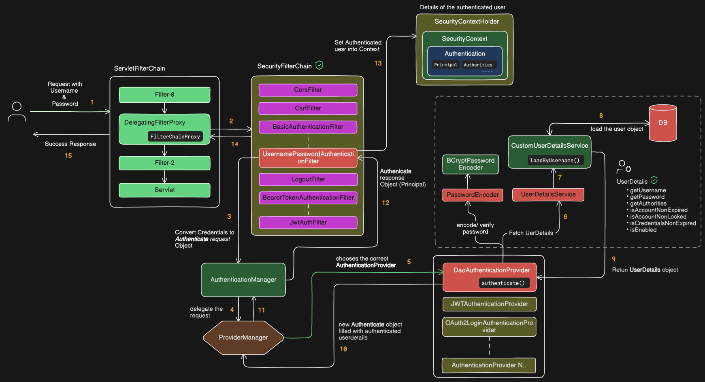

# Spring Boot Security using Database Form Based

[📄 Articles](https://nirmalakumarsahu.in/spring-boot.html) | [👤 My Profile](https://nirmalakumarsahu.in)

[](https://spring.io/projects/spring-boot) [](https://spring.io/projects/spring-security)

[](https://spring.io/projects/spring-framework) [](https://spring.io/projects/spring-framework)

---

## 📑 Index

- [📋 Prerequisites](#-prerequisites)
- [📝 Spring Boot Security Internal Flow](#-spring-boot-security-internal-flow)
- [🚀 Implementation](#-implementation)
  - [🏗️ Technology Stack](#-technology-stack)
  - [📂 Project Structure](#-project-structure)
  - [🔗 Code Repository](#-code-repository)
  - [🚀 To Run the Spring Boot Application](#-to-run-the-spring-boot-application)

---

## 📋 Prerequisites

🔹 Understand **Spring Security** basic concepts 👉 [Read here](https://nirmalakumarsahu.in/spring-boot/security/spring-boot-security.html)

### [🔝 Back to Top](#-index)

---

## 📝 Spring Boot Security Internal Flow

💡 Let's understand **how Spring Boot Security works with a database** for **form-based authentication**.



**1. Request with Credentials**

* The client sends a request with a **username** and **password** (e.g., via login form, API call).
* This request enters the **Servlet Filter Chain**.

**2. DelegatingFilterProxy & FilterChainProxy**

* Spring Security uses `DelegatingFilterProxy` to intercept requests.
* It passes the request to the **SecurityFilterChain**, which contains security-related filters (authentication, authorization, CSRF, CORS, etc.).

**3. Filter Converts Credentials**

* The **UsernamePasswordAuthenticationFilter** extracts the username and password from the request.
* It creates an **Authentication request object** (with credentials but not yet authenticated).

**4. AuthenticationManager**

* The request is passed to the **AuthenticationManager**.

**5. ProviderManager**

* `AuthenticationManager` delegates to **ProviderManager**.
* `ProviderManager` chooses the correct **AuthenticationProvider** (e.g., `DaoAuthenticationProvider` for username/password authentication).

**6. Fetch User Details**

* The provider calls the **UserDetailsService** to fetch user information.

* **7. Load User by Username**

* The `CustomUserDetailsService` implements `loadUserByUsername()` to retrieve the user.
* This may involve fetching user data from a database.

**8. Database Call**

* A query is made to load the user’s record from the database.

**9. UserDetails Object**

* The database results are mapped to a **UserDetails** object, which contains:

    * Username
    * Password (hashed)
    * Authorities (roles/permissions)
    * Account status flags (expired, locked, enabled, etc.).

**10. Return Authenticated Object**

* The provider compares the password from the request with the stored hash using **PasswordEncoder** (`BCryptPasswordEncoder` here).
* If successful, a new **Authentication object** is created, now **filled with authenticated user details**.

**11. Authentication Response**

* The authenticated object is returned back up the chain to the **AuthenticationManager**.

**12. Filter Receives Authentication Response**

* The `UsernamePasswordAuthenticationFilter` gets the authenticated object from the manager.

**13. Set Authenticated User into Context**

* The authenticated object (with user details) is stored inside the **SecurityContext** using `SecurityContextHolder`.

**14. Continue Filter Chain**

* The request proceeds through the remaining filters.

**15. Success Response**

* The server returns a successful response to the client.
* Now, in any part of the application, you can retrieve the authenticated user from:

```java
Authentication auth = SecurityContextHolder.getContext().getAuthentication();
Object principal = auth.getPrincipal();
```

### [🔝 Back to Top](#-index)

---

## 🚀 Implementation

### 🏗️ Technology Stack

**🖥️ Backend**

* ☕ **Java 21** → Core programming language
* 🌱 **Spring Boot 3.5.4** → Main application framework
* 🗄️ **Spring Data JPA** → ORM layer for database interaction
* 🔐 **Spring Security** → Authentication & Authorization
* 🌐 **Spring Web (Spring MVC)** → REST APIs & Controller layer

**🎨 Frontend**

* 📝 **Thymeleaf** → Template engine for dynamic HTML rendering
* 🔑 **Thymeleaf Extras – Spring Security 6** → Security tags in views (`sec:authorize`)

**🛢️ Database**

* 🐬 **MySQL** → Primary relational database
* 🧩 **MySQL Connector/J** → JDBC driver for MySQL

**🏗️ Build & Dependency Management**

* 📦 **Maven 4.0.0** → Build automation & dependency management
* 🚀 **Spring Boot Maven Plugin** → Runs & packages the app
* 🛠️ **Maven Compiler Plugin** → Annotation processing (with Lombok)

**⚙️ Utilities**

* ✨ **Lombok** → Eliminates boilerplate code (`@Getter`, `@Setter`, etc.)
* 📜 **application.yml** → Centralized configuration (DB, Security, JPA, etc.)


### 📂 Project Structure

```plaintext
spring-boot-security-using-database-form-based
│── 📂 src/
│   └── 📂 main/
│       ├── 📂 java/
│       │   └── 📂 com/sahu/springboot/security/
│       │       ├── 📂 config/        
│       │       │   ├── 📄 CustomAuthenticationEntryPoint.java
│       │       │   └── 📄 SecurityConfiguration.java
│       │       │
│       │       ├── 📂 constant/      
│       │       │   └── 📄 AuthConstants.java
│       │       │
│       │       ├── 📂 controller/    
│       │       │   ├── 📄 AuthController.java
│       │       │   └── 📄 HomeController.java
│       │       │
│       │       ├── 📂 dto/           
│       │       │   └── 📄 UserRequest.java
│       │       │
│       │       ├── 📂 model/         
│       │       │   ├── 📄 Role.java
│       │       │   └── 📄 User.java
│       │       │
│       │       ├── 📂 repository/    
│       │       │   ├── 📄 RoleRepository.java
│       │       │   └── 📄 UserRepository.java
│       │       │
│       │       ├── 📂 security/      
│       │       │   ├── 📂 dto/
│       │       │   │   └── 📄 CustomUserDetails.java
│       │       │   └── 📂 util/
│       │       │       └── 📄 SecurityUtil.java
│       │       │
│       │       ├── 📂 service/       
│       │       │   ├── 📂 impl/
│       │       │   │   ├── 📄 CustomUserDetailsService.java  
│       │       │   │   └── 📄 UserServiceImpl.java           
│       │       │   │
│       │       │   └── 📄 UserService.java                   
│       │       │
│       │       └── 📄 SpringBootSecurityUsingDatabaseFormBasedApplication.java
│       │
│       └── 📂 resources/
│           ├── 📂 static/            
│           ├── 📂 templates/         
│           │   ├── 📂 error/ 
│           │   │   └── 📄 403.html
│           │   ├── 📄 admin-dashboard.html
│           │   ├── 📄 dashboard.html
│           │   ├── 📄 login.html
│           │   ├── 📄 registration.html
│           │   └── 📄 user-dashboard.html
│           └── 📄 application.yml    
│
├── 📄 docker-compose.yml
└── 📄 pom.xml
```

### 🔗 Code Repository

You can find the complete code repository for this project on GitHub:

[](https://github.com/nirmalakumarsahu/spring-boot-security-using-database-form-based.git)


### 🚀 To Run the Spring Boot Application

**1️⃣ 🐳 Using Docker Compose (for MySQL container)**

```bash
docker-compose up -d
```

✅ This starts MySQL in a container (`-d` = detached mode).
🔍 Verify with:

```bash
docker ps
```

📌 DB is now available at **`localhost:3307`**.
🔑 Credentials (username, password, DB name) are in `docker-compose.yml`.

**2️⃣ 💻 Run Directly in IntelliJ IDEA**

1. 📂 Open the Spring Boot project in IntelliJ.
2. ▶️ In **Project Explorer**, right-click the main class:
   `SpringBootSecurityUsingDatabaseFormBasedApplication.java`
3. Select **Run 'SpringBootSecurityUsingDatabaseFormBasedApplication'**.
4. 🐞 For debugging, click the **Debug button** instead of Run.
5. 🌐 App will start on **[http://localhost:9897](http://localhost:9897)**.

**3️⃣ ⚡ Run with Maven Command (CLI)**

* ▶️ Run app:

  ```bash
  mvn spring-boot:run
  ```

* 🐞 Run app with debug mode:

  ```bash
  mvn spring-boot:run -Dspring-boot.run.fork=false -Dmaven.surefire.debug
  ```

* 📦 Build JAR and run:

  ```bash
  mvn clean package -DskipTests
  java -jar target/spring-boot-security-using-database-form-based-0.0.1-SNAPSHOT.jar
  ```

### [🔝 Back to Top](#-index)

--- 

## 🎥 Video Reference

<video width="640" height="360" controls>
  <source src="https://www.youtube.com/watch?v=p1Wm5dbLuHs" type="video/mp4">
  Your browser does not support the video tag.
</video>

### [🔝 Back to Top](#-index)

### [📖 Read More ➡️](https://nirmalakumarsahu.in/spring-boot.html)

---